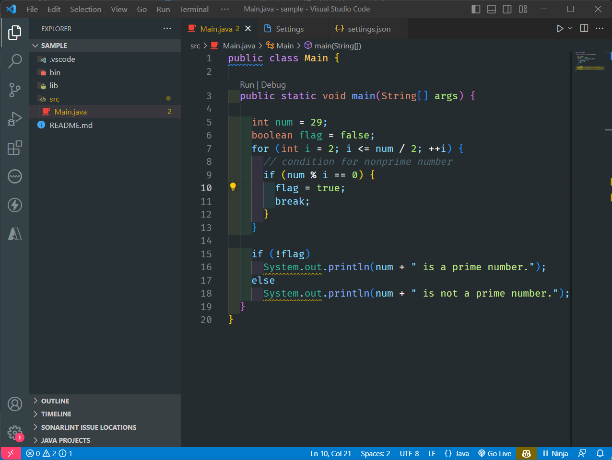

# Vampire Color Theme

Step into the realm of 'Vampire' and embrace a darker, more enigmatic coding atmosphere. The extension builds upon the iconic Dracula theme, but with a palette transformation that introduces a mesmerizing spectrum of tones. From the subtlest hints of midnight purples to the profound richness of velvety blacks, 'Vampire' captures the essence of nightfall, infusing your coding environment with an air of mystery and intrigue.

## Screenshot

## More that a theme

The 'Vampire' theme extension is not merely a variation; it's an artistic reimagination that acknowledges the roots of Dracula while embracing a new depth of visual sophistication. Whether you're a nocturnal coder seeking an immersive ambiance or an aficionado of meticulously crafted themes, 'Vampire' is your gateway to a coding experience that's both familiar and strikingly novel.

Built with love by ebenjs.

**Enjoy!**
